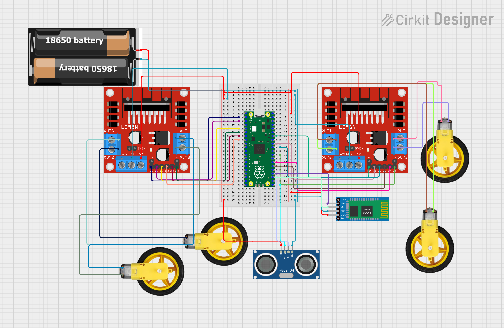

# Human-Following Robot & Autonomous Car (Raspberry Pi Pico H)

[](https://youtu.be/7tj5DYpUOXI?si=-CWaPK44fme6uQhk)
[](#)
[](#license)

A low-cost robot car that **follows a person/object** and **avoids obstacles** using ultrasonic sensing and a simple reactive controller on the Raspberry Pi Pico H. Optional Bluetooth (HC-05/HC-06) enables **start/stop**, **manual driving**, and **telemetry** (distance, direction).

> 📄 This repository includes the full project report, wiring/circuit diagrams, MicroPython firmware, Android Bluetooth app, demo video, and build photos.

---

## Table of Contents

- [Features](#features)
- [Demo](#demo)
- [Car Images](#car-images)
- [Hardware](#hardware)
- [Wiring Overview](#wiring-overview)
- [Setup](#setup)
- [Firmware (MicroPython)](#firmware-micropython)
- [Bluetooth Commands](#bluetooth-commands)
- [How It Works](#how-it-works)
- [Troubleshooting](#troubleshooting)
- [Figures (from report)](#figures-from-report)
- [License](#license)
- [Credits](#credits)

---

## Features

- Ultrasonic **distance keeping** and **person/object following**
- **Obstacle avoidance** with reverse & reorient behavior
- **Bluetooth** remote: start/stop, manual drive, distance/direction queries
- **Four DC motors** driven by dual H-bridge drivers (L298N/L293D)
- Optional **servo sweep** (SG90) for left/center/right scanning
- Clean, readable **MicroPython** code for Raspberry Pi Pico H

---

## Demo

▶️ **Video:** https://youtu.be/7tj5DYpUOXI?si=-CWaPK44fme6uQhk  
📂 Local copy: [Project Video/Project video.mp4](Project%20Video/Project%20video.mp4)

---

## Car Images

Build photos from the final prototype:

  


> More photos in the **[Car Images](Car%20Images/)** folder.

---

## Hardware

- **MCU:** Raspberry Pi Pico H (RP2040)
- **Motors:** 4× TT geared DC motors (differential drive)
- **Motor Drivers:** 2× L298N (or L293D)
- **Distance Sensor:** HC-SR04 ultrasonic
- **(Optional) Scanner:** SG90 micro servo (for sensor sweep)
- **Bluetooth:** HC-05 or HC-06 (UART, 9600 bps)
- **Power:** 2× 18650 Li-ion (≈7.4 V) + 5 V/3.3 V regulation
- **Misc:** Breadboard, jumpers, switch, battery holders

---

## Wiring Overview

> **Tip:** Exact GPIO choices are flexible. Keep **common GND** between Pico, drivers, sensor, and Bluetooth.

**Suggested pin map (edit as needed):**

| Module        | Signal                 | Pico Pin (example) |
|---------------|------------------------|--------------------|
| HC-SR04       | TRIG                   | GP3                |
| HC-SR04       | ECHO                   | GP2                |
| SG90 Servo    | PWM signal             | GP4                |
| Motor Driver A| IN1, IN2, **ENA(PWM)** | GP6, GP7, GP5      |
| Motor Driver B| IN3, IN4, **ENB(PWM)** | GP9, GP10, GP8     |
| Bluetooth     | TXD → Pico **RX**      | GP1 (UART0 RX)     |
| Bluetooth     | RXD ← Pico **TX**      | GP0 (UART0 TX)     |
| Drivers Power | +7.4 V (battery)       | L298N **VIN**      |
| Pico Power    | 5 V/3.3 V              | **VBUS/VSYS**, 3V3 |

- Drive **ENA/ENB** with PWM for speed; **INx** set direction.
- HC-SR04: send **10 µs** pulse on **TRIG**, measure **ECHO** pulse width, convert to **cm**.

📷 See more in the [Car Images](Car%20Images/) folder.  

---

## 🔌 Circuit & Flowchart

-   
-   

More diagrams and detailed explanations are in the [Report](Report/).  

---

## ⚙️ Working Principle (from Report)

1. **Ultrasonic Sensing** – The HC-SR04 measures distance by sending ultrasonic pulses and timing their echo.  
2. **Decision Logic** –  
   - If the object is **too close**, the robot reverses.  
   - If the object is **too far**, the robot moves forward.  
   - If the object is **within range**, it stays idle.  
   - If the object is off-center, the servo scans left/right and the robot adjusts direction.  
3. **Motor Control** – The Pico drives the motors via PWM signals to the L298N motor driver.  
4. **Bluetooth Control** – The HC-05/HC-06 module allows manual control (`START`, `STOP`, `LEFT`, `RIGHT`, `FWD`, `REV`) and telemetry requests (`DIST?`, `DIR?`).  


---

## Setup

1. **Flash MicroPython** to the Pico (e.g., via **Thonny**).  
2. Copy `code.py` (below) to the Pico as `main.py` (or keep as `code.py` and run manually).  
3. Wire components per the **Wiring Overview**.  
4. Pair phone with **HC-05/HC-06** (PIN `1234`/`0000`).  
5. Use any Bluetooth serial controller to send commands (see **Bluetooth Commands**).

---

## Firmware (MicroPython)

Create `main.py` on the Pico with the following code (edit pins/constants to match your wiring):

```python
# main.py — Human-Following Robot (Pico H + HC-SR04 + L298N + HC-05/06)
# Adjust GPIO numbers to match your wiring.

from machine import Pin, PWM, UART
import time

# ====== Config ======
TARGET_CM      = 50         # desired following distance (cm)
TOLERANCE_CM   = 10         # acceptable +/- range
FOLLOW_DUTY    = 50000      # motor speed (0-65535)
TURN_DUTY      = 45000
SCAN_USE_SERVO = True       # set False if no servo is used

# Pins (edit to match Wiring Overview)
TRIG = Pin(3, Pin.OUT)
ECHO = Pin(2, Pin.IN)

servo = PWM(Pin(4)) if SCAN_USE_SERVO else None
if servo:
    servo.freq(50)  # 50Hz for typical servos

# Motor A (left/right depending on wiring)
ENA = PWM(Pin(5)); ENA.freq(1000)
IN1 = Pin(6, Pin.OUT); IN2 = Pin(7, Pin.OUT)
# Motor B
ENB = PWM(Pin(8)); ENB.freq(1000)
IN3 = Pin(9, Pin.OUT); IN4 = Pin(10, Pin.OUT)

# Bluetooth UART (HC-05/06 default 9600)
uart = UART(0, baudrate=9600, tx=Pin(0), rx=Pin(1))

# ====== Helpers ======
def set_servo_us(us):
    # 1000us ~ 0°, 1500us ~ 90°, 2000us ~ 180°
    if not servo:
        return
    duty = int((us/20000.0) * 65535)
    servo.duty_u16(duty)

def angle_to_us(deg):
    return 1000 + int((deg/180.0)*1000)

def pulse_in(pin, level, timeout_us=30000):
    t0 = time.ticks_us()
    while pin.value() != level:
        if time.ticks_diff(time.ticks_us(), t0) > timeout_us:
            return 0
    t1 = time.ticks_us()
    while pin.value() == level:
        if time.ticks_diff(time.ticks_us(), t0) > timeout_us:
            return 0
    return time.ticks_diff(time.ticks_us(), t1)

def read_distance_cm():
    TRIG.low(); time.sleep_us(2)
    TRIG.high(); time.sleep_us(10)
    TRIG.low()
    dur = pulse_in(ECHO, 1, timeout_us=40000)
    if dur == 0:
        return 999
    # speed of sound ~343 m/s => cm = (us * 0.0343)/2
    return (dur * 0.0343) / 2

def motors_stop():
    ENA.duty_u16(0); ENB.duty_u16(0)
    IN1.low(); IN2.low(); IN3.low(); IN4.low()

def motors_forward(duty):
    IN1.high(); IN2.low()
    IN3.high(); IN4.low()
    ENA.duty_u16(duty); ENB.duty_u16(duty)

def motors_backward(duty):
    IN1.low(); IN2.high()
    IN3.low(); IN4.high()
    ENA.duty_u16(duty); ENB.duty_u16(duty)

def turn_left(duty):
    IN1.low(); IN2.high()
    IN3.high(); IN4.low()
    ENA.duty_u16(duty); ENB.duty_u16(duty)

def turn_right(duty):
    IN1.high(); IN2.low()
    IN3.low(); IN4.high()
    ENA.duty_u16(duty); ENB.duty_u16(duty)

def scan_distances():
    if not servo:
        return {"center": read_distance_cm()}
    readings = {}
    for label, ang in [("left", 150), ("center", 90), ("right", 30)]:
        set_servo_us(angle_to_us(ang)); time.sleep_ms(250)
        readings[label] = read_distance_cm()
    return readings

def closest_direction(readings):
    # returns "left"/"center"/"right" by smallest distance
    return min(readings, key=lambda k: readings[k])

# ====== Bluetooth ======
def bt_send(msg):
    try:
        uart.write((msg + "\n").encode())
    except:
        pass

def handle_bt(cmd):
    cmd = cmd.strip().upper()
    if cmd == "START":
        bt_send("OK START")
        return "START"
    if cmd == "STOP":
        motors_stop(); bt_send("OK STOP")
        return "STOP"
    if cmd in ("LEFT","RIGHT","FWD","REV"):
        bt_send("OK " + cmd)
        return cmd
    if cmd == "DIST?":
        bt_send(f"DIST {int(read_distance_cm())}cm")
    if cmd == "DIR?":
        bt_send("DIR FOLLOW")
    return None

# ====== Main Loop ======
state = "STOP"
bt_send("READY")

try:
    while True:
        # read BT
        if uart.any():
            msg = uart.readline().decode(errors="ignore")
            act = handle_bt(msg)
            if act:
                state = act

        if state == "STOP":
            motors_stop()
            time.sleep_ms(50)
            continue

        # Manual overrides
        if state == "LEFT":
            turn_left(TURN_DUTY);  time.sleep_ms(100); continue
        if state == "RIGHT":
            turn_right(TURN_DUTY); time.sleep_ms(100); continue
        if state == "FWD":
            motors_forward(FOLLOW_DUTY); time.sleep_ms(100); continue
        if state == "REV":
            motors_backward(FOLLOW_DUTY); time.sleep_ms(100); continue

        # Autonomous follow
        r = scan_distances()
        dirn = closest_direction(r)
        if dirn == "left":
            turn_left(TURN_DUTY);  time.sleep_ms(120); continue
        if dirn == "right":
            turn_right(TURN_DUTY); time.sleep_ms(120); continue

        dist = r.get("center", read_distance_cm())

        if dist < (TARGET_CM - TOLERANCE_CM):
            motors_backward(FOLLOW_DUTY)
        elif dist > (TARGET_CM + TOLERANCE_CM) and dist < 300:
            motors_forward(FOLLOW_DUTY)
        else:
            motors_stop()

        time.sleep_ms(60)

except KeyboardInterrupt:
    motors_stop()
